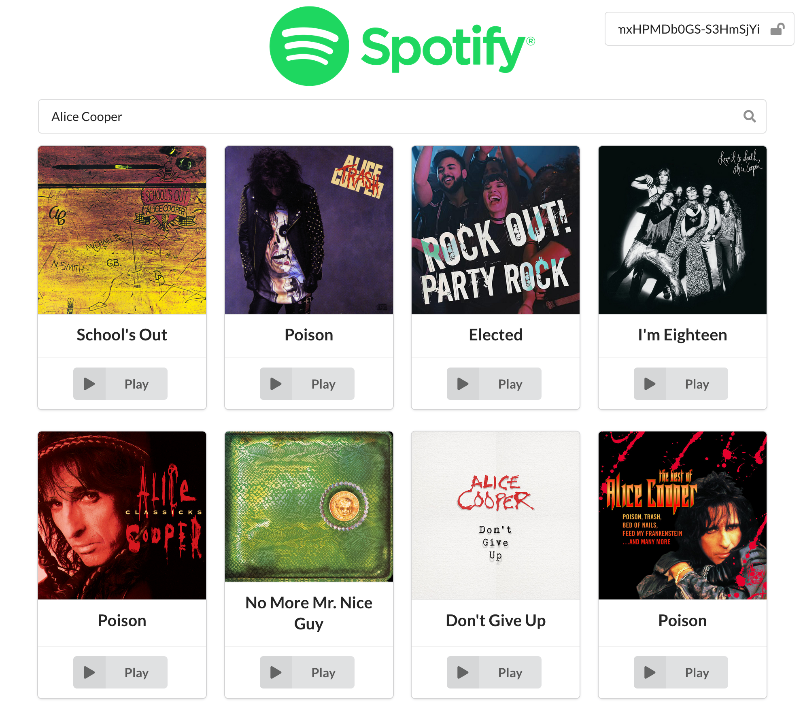

# O'Clock Spotify

Normalement tout le monde aime la musique... aujourd'hui, on va créer un client spotify ! 🎷🎸🎻

Objectif : pouvoir rechercher des musiques grâce à l'API Spotify, et écouter des extraits 🎧

## Préambule

- Créer un compte spotify si l'on en n'a pas encore (https://www.spotify.com/fr/signup/) 
  - il n'est pas nécessaire d'avoir un compte premium.
- Se rendre sur la documentation de l'endpoint que nous allons utiliser : https://developer.spotify.com/console/get-search-item/
- Cliquer sur le bouton "GET TOKEN" en bas.
  - Ce token est valable **une heure**
    - 🚨 On devra donc le renouveller pendant la journée 🚨
    - Gardons le sous la main !
  - Nous allons l'utiliser pour autenthifier les requêtes
  - Un champ est prévu dans l'application pour saisir ce champ

## Considérations générales

- Pour construire notre interface, nous allons utiliser Semantic UI comme sur l'atelier Github 🎨
- On va bien entendu utiliser Redux 🤓
- Ce travail est en groupe de pair programming, groupes libres 
  - 🚨 Donc un seul repo par groupe ! 🚨
  - Si vous ne finissez pas tout, ce n'est pas grave, **l'important c'est que tout le groupe soit à l'aise sur le code produit**
- Un peu de code est déjà fourni 🤓
  - ...mais ca ne marche pas très bien... 
  - il va falloir commencer par debugguer tout ca et s'assurer que tout fonctionne bien 
  - 🚨 il n'y a donc pas besoin de copier le React-Modèle 🚨

## Debug 👷

L'application pour l'instant est censée afficher des données statiques, en provenance du fichier `src/data/track_search.js`.
Je n'ai pas réussi à faire marcher mes champ contrôlés...
Ah et l'affichage des cartes a pas l'air de marcher non plus... Mais je crois que je suis pas loin 😥

## Objectifs ✔️

- Debugguer le code fourni
- Faire une recherche sur des pistes, grâce à un champ contrôlé
  - La recherche doit se faire à l'appui sur la touche Entrée
  - pas a chaque changement du champ contrôlé, sinon on va surcharger l'api !
- Afficher les musiques en provenance de la recherche 
  - Un composant pour jouer la musique est déja fourni 👷

## Bonus

**À faire dans l'ordre que vous voulez, commencez par ce qui vous botte le plus**

## Chargement 

Ce serait quand même bien d'afficher un loader, le temps de la requête !

## Gérer la pagination 📃
  - avec des boutons de numéro de page...
  - ou des Suivant/Précédent...
  - ou "Afficher plus"...
  - ce qui vous arrange !

## Route 'Artistes'

On l'a un peu oublié recémment, alors on va refaire du React-Router 🤓
- Ajouter des routes dans notre application 🚗🛣️
  - une route `/tracks` avec ce que l'on a fait jusque ici
  - une route `/artists` pour chercher un artiste
    - les résultats seront affichés sous forme de Card
    - des données statiques sont fournies pour vos tests : `src/data/artist_search.js`
  - lorsque l'on clique sur un Artiste, afficher ses "top tracks"
    - tiens, il faudrait regarder si un endpoint existe pour cette donnée...
  - et du coup des liens dans un Header pour passer d'une route à l'autre

## J'en veux encore 🤪

- Il y a plein d'endpoints dans la doc !
  - on pourrait chercher des albums
  - faire une route pour afficher les track que vous avez likées dans Spotify
  - jouer avec les genres et les recommandations
  - etc

## Méthodologie

- On commence par bien tester les requêtes dans Postman !
  - la doc nous fournit une requête cURL que l'on peut importer dans Postman / Insomnia
  - on regarde toutes les données que l'api vous envoie !
- On prend un peu de recul pour réfléchir au design de notre store
- Des fichiers de données statiques sont la pour nous aider.
- On avance progressivement, on console.log tout ce dont on n'est pas certain...
- On vérifie qu'on ne se trompe pas sur les noms de clé !

## Fin

Un challenge pour demain vous attend à 15h, alors ne passez pas la nuit sur ce projet 😀
